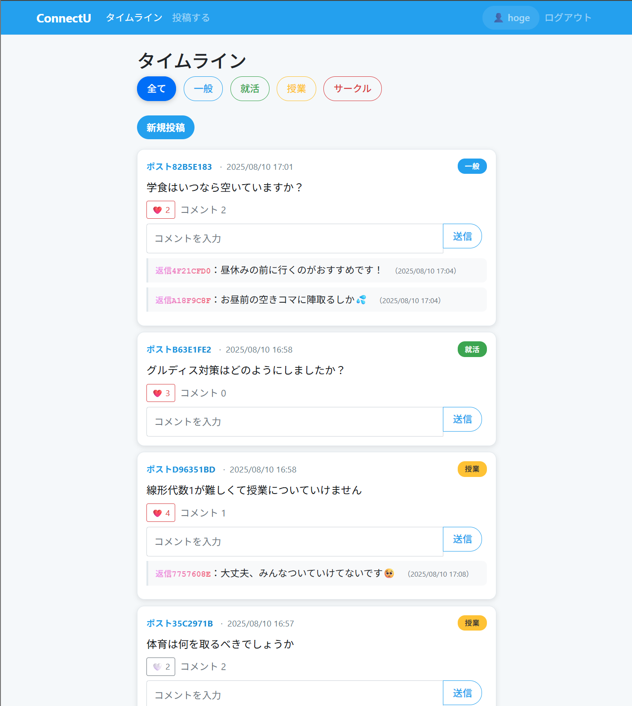

# ConnectU - 大学生向け匿名悩み相談アプリ

大学生が匿名で悩みを相談・共有できるSNSアプリケーション

## 概要

**ConnectU**は、大学生が学業、就活、サークル活動などの悩みを匿名で投稿・相談できるWebアプリケーションです。投稿者の匿名性を完全に保護しながら、チャンネル別に整理された投稿で効率的な情報共有を実現します。

## 主な機能

- **ユーザー登録/ログイン**: アカウント作成とログイン機能（認証のみに使用）
- **匿名投稿機能**: 140文字までの完全匿名テキスト投稿
- **チャンネル別投稿**: 一般・就活・授業・サークルの4つのチャンネルで投稿を分類
- **匿名タイムライン**: 全投稿を匿名ID（ポスト〇〇）で時系列表示
- **匿名コメント機能**: 投稿に対する匿名返信（返信〇〇）
- **いいね機能**: 投稿への匿名評価機能
- **マイページ**: 自分の投稿のみを表示（自分の投稿・コメントは実名表示）
- **投稿削除機能**: 自分の投稿の論理削除

## 匿名性の特徴

- 投稿者は一意な匿名ID（例：ポスト1A2B3C4D）で表示
- 同じユーザーでも投稿ごとに異なる匿名IDを生成
- コメントも独立した匿名ID（例：返信5E6F7G8H）
- 削除による欠番問題を解決するハッシュベース識別
- マイページでのみ自分の投稿・コメントを実名表示

## 技術スタック

- **バックエンド**: Python/Flask
- **データベース**: SQLite + SQLAlchemy
  - 将来的にはRenderのPostgreSQLを外部データベースとして運用することを想定
  - 現時点では開発用のSQLiteを使用
- **認証**: Flask-Login
- **フロントエンド**: HTML/CSS/Jinja2/Bootstrap
- **匿名化**: SHA256ハッシュベース匿名ID生成

---

## TrackJob beginner's Hackathon での発表(チーム僕、K、F)

### ターゲット

大学生

### ターゲットが抱える悩み

- 就活
- インターン
- 勉強
- バイト
- 人間関係
- サークル

### アプリが実現したこと

ターゲットが抱える悩みを気軽に相談できる場所を実現した

### アプリの売りポイント

- 匿名なので対面で言いにくいことも相談できる
- 似た悩みを抱えていた先輩から直接アドバイスをもらえる
- 同じ悩みを持つ人と相談できる
- コメント、いいねをつけられる
- 悩み事の投稿を見ることができる

### 上手くいったこと / いかなかったこと

**上手くいったこと**
- 初めてのハッカソン参加かつ友達とのチーム参加で不安だったが、意欲あるチームメンバーさんのおかげでスムーズに連携がとれ、最適なアイデアも構想でき、時間内に実装まで進めることができた(僕)
- これまでデータベースに情報を保存する処理は未経験だったが、今回の開発でできるようになった(K)
- ハッカソンでチーム開発を行うのは初めてだったが、テーマ決めがスムーズに進み、方向性を早く固められた(K)
- プログラミング経験が浅い且つ、初めてのチーム開発だったが、役割分担や意見交換をしながら一つのアプリを作ることができた(F)
**上手くいかなかったこと**
- 短期間での開発だし、ブランチの管理も適当でいいかと思っていたが、
後にチームメンバーの機能をマージする際に想定以上に苦戦していたため、
やはり最低限のルール管理(特にブランチ規則)は必要だったと再確認した
- 初めてGitHubを使って他の人と共同でプログラムを書いたため、ブランチの運用やファイルのマージ方法に慣れておらず、コンフリクトの解消に時間がかかった(F)
- エラー原因の特定から修正までに時間をかけすぎたのが反省点(F)
- 投票（アンケート）機能→実装までできなかった…(F)

### 今後の展望

- 投票機能の実装
  - 例: 体育はどちらを選択すべき？「テニス vs. バスケ」 など

- 独自性の強化
  - 情報所持者(例: 先輩)が答えやすくなるようなインセンティブ設計

- 技術面での刷新
  - リアルタイム更新
  - 大規模なデータストリームにも対応できるようなデータ基盤の構築
  - セキュリティ(特に匿名化周辺)の強化

---

## 開発環境セットアップ

1. リポジトリをクローン
```bash
git clone https://github.com/yourusername/connectu.git
cd connectu
```

2. 仮想環境を作成し、依存関係をインストール
```bash
python -m venv venv
source venv/bin/activate  # Windowsの場合: venv\Scripts\activate
pip install -r requirements.txt
```

3. 環境変数を設定（.envファイルを作成）
```
SECRET_KEY=your-secret-key-here
DATABASE_URL=sqlite:///data.db
```

4. アプリケーションを実行
```bash
python app.py
```

5. ブラウザでアクセス: http://127.0.0.1:5000/

## トラブルシューティング

### Internal Server Error が発生した場合

- データベーススキーマの更新時、旧dbファイルとの不整合が原因の可能性あり
- 個人開発では最悪dbファイルを初期化？
- 本番環境への移行時はデータベースのマイグレーションを実行：

```bash
# データベースを再作成
python migrate_comments.py

# または手動でDBファイルを削除して再作成
rm data.db
python app.py
```

## ライセンス

[MIT License](LICENSE)

---


## 操作画面
